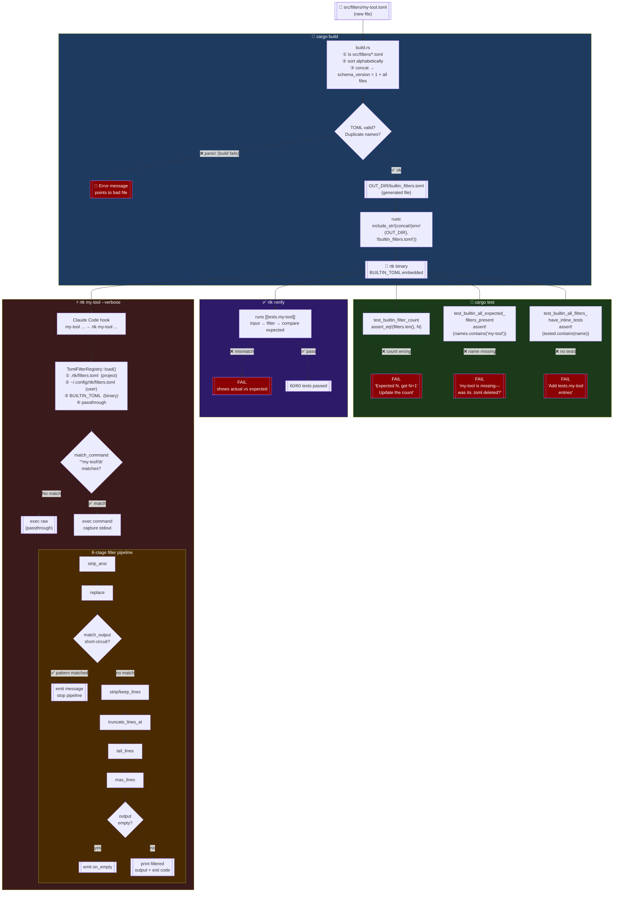
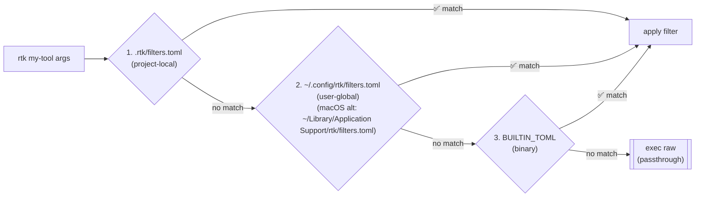

# How a TOML filter goes from file to execution

This document explains what happens between "I created `src/filters/my-tool.toml`" and "RTK filters the output of `my-tool`".

## Build pipeline



## Step-by-step summary

| Step | Who | What happens | Fails if |
|------|-----|--------------|----------|
| 1 | Contributor | Creates `src/filters/my-tool.toml` | — |
| 2 | `build.rs` | Concatenates all `.toml` files alphabetically | TOML syntax error, duplicate filter name |
| 3 | `rustc` | Embeds result in binary via `BUILTIN_TOML` const | — |
| 4 | `cargo test` | 3 guards check count, names, inline test presence | Count not updated, name not in list, no `[[tests.*]]` |
| 5 | `rtk verify` | Runs each `[[tests.my-tool]]` entry | Filter logic doesn't match expected output |
| 6 | Runtime | Hook rewrites command, registry looks up filter, pipeline runs | No match → passthrough (not an error) |

## Filter lookup priority at runtime



First match wins. A project filter with the same name as a built-in shadows the built-in and triggers a warning:

```
[rtk] warning: filter 'make' is shadowing a built-in filter
```
